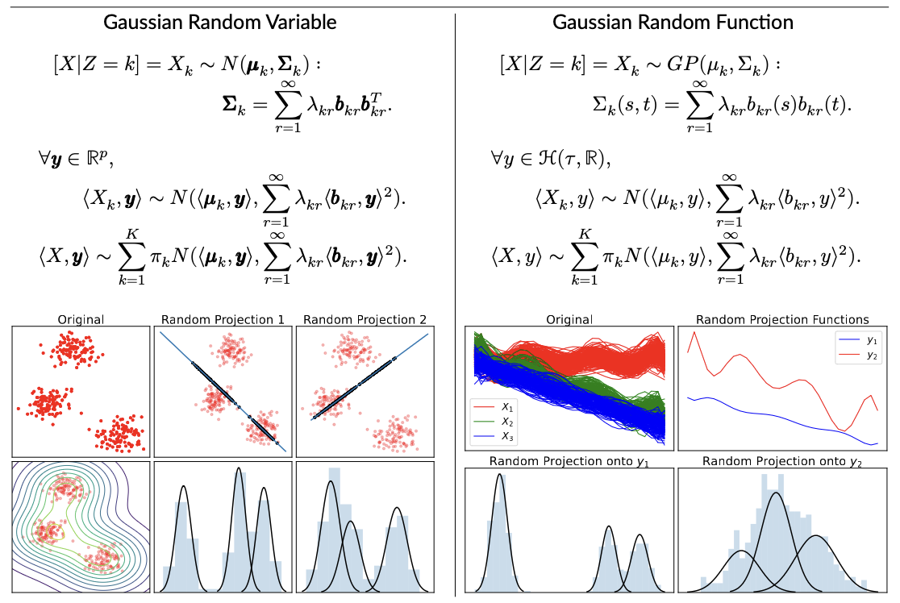
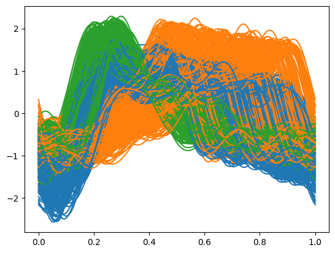
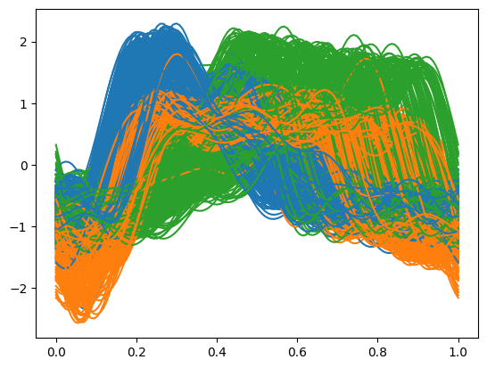

# About GPmix

[GPmix](GPmix) is a clustering algorithm for functional data that are generated from Gaussian process mixtures. Although designed for Gaussian process mixtures, our experimental study demonstrated that GPmix works well even for functional data that are not from Gaussian process mixtures.

The main steps of the algorithm are:

<ul>
 <li><strong>Smoothing</strong>: Apply smoothing methods on the raw data to get continuous functions.</li>
 <li><strong>Projection</strong>: Project the functional data onto a few randomly generated functions.</li>
 <li><strong>Learning GMMs</strong>: For each projection function, learn a univariate Gaussian mixture model from the projection coefficients.</li>
 <li><strong>Ensemble</strong>: Extract a consensus clustering from the multiple GMMs.</li>
</ul>

If you used this package in your research, please cite it:
```latex
@InProceedings{pmlr-AK2024,
  title =        {Learning mixtures of {Gaussian} processes through random projection},
  author =       {Akeweje, Emmanuel and Zhang, Mimi},
  booktitle = 	 {Proceedings of the 41st International Conference on Machine Learning},
  pages = 	 {},
  year = 	 {2024},
  editor = 	 {},
  volume = 	 {},
  series = 	 {Proceedings of Machine Learning Research},
  month = 	 {21--27 Jul},
  publisher =    {PMLR},
}
```


# Package Functions
##  `GPmix.Smoother`
Apply smoothing methods on the raw data to get continuous functions.
```python
Smoother(basis = 'bspline', basis_params = {}, domain_range = None)
```
**Parameter Details**
- <strong> basis {'bspline', 'fourier', 'wavelet', 'nadaraya_watson', 'knn'} </strong>: a string specifying the smoothing method to use. The default value is `'bspline'`. 
- <strong> basis_params (dict) </strong>: additional parameters for the selected smoothing method.  The default value is `{}`.  Below are examples of how to specify these parameters for different smoothing methods:
    ```
    Smoother(basis = 'bspline', basis_params = {'order': 3, 'n_basis': 20})
    Smoother(basis = 'wavelet', basis_params = {'wavelet': 'db5', 'mode': 'soft'}) 
    Smoother(basis = 'knn', basis_params = {'bandwidth': 1.0})
    Smoother(basis = 'fourier', basis_params = {'n_basis': 20, 'period': 1})
    ```
    For all smoothing methods except wavelet, if `basis_params` is not specified, the parameters are selected via the Generalized Cross-Validation (GCV) technique.<br>
    For wavelet smoothing, the wavelet shrinkage denoising technique is implemented, requiring two parameters:
    - `'wavelet'`: The type of wavelet to use for the transformation. The available wavelet families are: {...} .
    - `'mode'`: The method and extent of denoising. The avaiable modes are: {'soft', 'hard', 'garrote', 'greater', 'less'}.<br>
   
   If `basis_params` is not specified for wavelet smoothing, the default configuration `basis_params = {'wavelet': 'db5', 'mode': 'soft'}` will be used.
- <strong> domain_range (tuple) </strong>: the domain of the functions. The default value is `None`. <br>
    If `domain_range = None`, the domain range is either set to [0,1]  if data is array-like, 
    or set to the domain_range of the data if data is FDataGrid object.

**Attributes**
- <strong> fd_smooth (FDataGrid)</strong>: functional data obtained from smoothing the given raw data.

**Methods**
- `fit(X, return_data = True)`: Construct smooth functions from the given raw data. <br>  
  - <strong> X (array-like of shape (n_samples, n_features) or FDataGrid object) </strong>: raw (sample) data.
  - <strong> return_data (bool) </strong>: returns smooth data if True. default = True

##  `GPmix.Projector`
Project the functional data onto a few randomly generated functions.
```python
Projector(basis_type, n_proj = 3, basis_params = {})
```
- <strong> basis_type {'fourier', 'fpc', 'wavelet', 'bspline', 'ou', 'rl-fpc'} </strong>: a string specifying the type of projection function. Supported projection functions include those generated from Fourier basis, eigen-functions, wavelets, B-spline basis, Ornstein-Uhlenbeck process and random linear combinations of eigen-functions.
- <strong> n_proj (int) </strong>: Number of projection functions to use, determining the number of univariate data batches to compute. default = 3.
- <strong> basis_param (dict) </strong>: additional hyperparameters required by some of the projection functions. default = { }. <br>
For the following projection functions, specify the following parameters:
  - Fourier Basis: `period`
  - B-spline: `order`
  - Wavelet Basis: `wv_name` (wavelet name) and `resolution` (base wavelet resolution)<br>

**Attributes** <br>
- <strong> n_features (int) </strong>: number of observed points for each sample curve and for the projection functions.
- <strong> basis (FDataGrid) </strong>: generated projection functions.
- <strong> coefficients (array-like of shape (n_proj, sample size)) </strong>: projection coefficients.

**Methods** <br>
- `fit(fdata)` : computes projection coefficients.
   - <strong> fdata (FDataGrid) </strong>: smooth functional data.<br>
**Returns**<br>
array-like object of shape (n_proj, sample size).
- `plot_basis()` : plots the projection functions.
- `plot_projection_coeffs(**kwargs)` : plots the distribution of projection coefficients. Takes `kwargs` from `seaborn.histplot`.

##  `GPmix.UniGaussianMixtureEnsemble`
For each projection function, learn a univariate Gaussian mixture model from the projection coefficients. Then extract a consensus clustering from the multiple GMMs.
```python
UniGaussianMixtureEnsemble(n_clusters, init_method = 'kmeans', n_init = 10, mom_epsilon = 5e-2)
```
- <strong> n_clusters (int) </strong>: specifying number of components in the mixture model.
- <strong> init_method {'kmeans', 'k-means++', 'random', 'random_from_data', 'mom'} </strong>: method for initializing the parameters of the GMMs. default = 'kmeans'.
- <strong> n_init (int) </strong>: the number of initializations to perform; returns the best fits. default = 10.
- <strong> mom_epsilon (float) </strong>: only applicable if 'init_method' set to 'mom'. Sets lower bound for GMM weights. default = 5e-2.
    
**Attributes**<br>
- <strong> n_projs (int) </strong>: number of base clusterings (or projections).
- <strong> data_size (int) </strong>: sample size.
- <strong> gmms (list) </strong> : a list of univariate GMMs fitted for each set of projection coefficients.
- <strong> clustering_weights_ (array-like of shape (n_projs,)) </strong>: weights for each of the base clusterings.

**Methods**<br>
- `fit_gmms(projs_coeffs,  n_jobs = -1, **kwargs)`: fits projection coefficients to univariate Gaussian mixture models.
  - <strong> projs_coeffs (array-like of shape (n_proj, sample size)) </strong> : projection coefficients.
  - <strong> n_jobs </strong>: number of concurrently running jobs to parrallelize fitting the gmms. default = -1 tries to use all available CPUs.
  - <strong> kwargs </strong>: any keyword argument of `joblib.Parallel`.
-  `plot_gmms(ncol = 4, fontsize = 12, fig_kws = { }, **kwargs)`: visualization of GMM fits.
   - <strong> ncol (int) </strong>: number of subplot columns. default = 4.
   - <strong> fontsize (int) </strong>: set fontsize for plot labels. default = 12.
   - <strong> fig_kws </strong>: any keyword argument for the figures (subplots). default = { }.
   - <strong> kwargs </strong>: other keyword arguments for customizing seaborn `histplot`.
- `get_clustering(weighted_sum = True, precompute_gmms = None)`: to obtain consensus clustering from bases the GMMs.
   - <strong> weighted_sum (bool) </strong>: specifies whether the total misclassification probability, which measures the overlap among the GMM components, should be weighted by the mixing proportion. default = True.
   - <strong> precompute_gmms (list) </strong>: a list of fitted univariate GMMs. By default, the method constructs the consensus clustering using the results from `fit_gmms`, however, users may occassionally want to construct the concensus clustering from a subset of the fitted GMMs. This parameter allows for such flexibility.
   **Returns**
    array-like object of shape (sample size,). The cluster labels for each sample curve.
- `plot_clustering(fdata)` : visualize clustering.
    - <strong> fdata (FDataGrid) </strong>: the clustered functional data.
- `adjusted_mutual_info_score(true_labels)`: computes Adjusted Mutual Information.
    - <strong> true_labels (array-like of shape (sample size,)) </strong> : true cluster labels.
- `adjusted_rand_score(true_labels)`: computes Adjusted Rand Index.
    - <strong> true_labels (array-like of shape (sample size,)) </strong> : true cluster labels.
- `correct_classification_accuracy(true_labels)`: computes Correct Classification Accuracy.
    - <strong> true_labels (array-like of shape (sample size,)) </strong> : true cluster labels.
- `silhouette_score(fdata)`: computes Silhouette Score.
    - <strong> fdata (FDataGrid) </strong> : the sample (functional) data.
- `davies_bouldin_score(fdata)`: computes Davies-Bouldin Score.
    - <strong> fdata (FDataGrid) </strong> : the sample (functional) data.
 
 ## `GPmix.misc.estimate_nclusters`
 Applies a technique based on the GPmix algorithm to estimate the optimal number of clusters in a dataset.
 ```python
estimate_nclusters(fdata, ncluster_grid = None)
```
- <strong> fdata (FDataGrid) </strong>: sample functional dataset.
- <strong> ncluster_grid (array-like) </strong>: specifies the grid within which the number of clusters is searched. default = [2, 3, ..., 14]. <br>

**Returns**<br>
    <strong> n_clusters (int) </strong>: estimated number of clusters in the sample functional dataset.
  
# Getting Started

This quick start guide will demonstrate how to use the package with the [CBF](CBF) dataset, one of the real-world datasets tested in our paper. Follow these steps to prepare the dataset for analysis:

```python
import numpy as np
data = np.concatenate([np.loadtxt('CBF\CBF_TEST.txt'), np.loadtxt('CBF\CBF_TRAIN.txt')])
X, y = data[:,1:], data[:,0]
```

To use the GPmix algorithm in your project, start by importing the necessary modules. The following import statements will include all the main functionalities from the GPmix package, as well as the specific utility for estimating the number of clusters:

```python
from GPmix import *
from GPmix.misc import estimate_nclusters
```

## Smoothing


Begin by initializing the `Smoother` object, specifying the type of basis for the smoothing process. The supported basis options include Fourier, B-spline, and wavelet basis. You can customize the smoothing by passing additional configurations through the `basis_params` argument. If not specified, the system will automatically determine the best configurations using methods like Random Grid Search and Generalized Cross Validation. After initialization, apply the `fit` method to your data to smooth it.

For this demonstration, we will use the Fourier basis.

```python
sm = Smoother(basis= 'fourier')
fd = sm.fit(X)
fd.plot(group = y)
```


## Projection
To project the sample functions onto specified projection functions, use the `Projector` object. Initialize the `Projector` object with the type of projection functions and the desired number of projections. The `basis_type` argument specifies the type of projection functions. Supported `basis_type` options are: eigen-functions from the fPC decomposition (fPC), random linear combinations of eigen-functions (rl-fPC), B-splines, Fourier basis, discrete wavelets, and Ornstein-Uhlenbeck (OU) random functions. The `n_proj` argument defines the number of projections. The `basis_params` argument allows for further configuration of the projection functions.

For this demonstration, we will use wavelets as projection functions. We will specify the family of wavelets using `basis_params`. After initializing, apply the `fit` method to the smoothed functions to compute the projection coefficients. Here, we will use 14 projection functions generated from the Haar wavelet family.

```python
proj = Projector(basis_type= 'wavelet', n_proj = 14, basis_params= {'wv_name': 'haar'})
coeffs = proj.fit(fd)
```

## Ensemble Clustering

The `UniGaussianMixtureEnsemble` object facilitates ensemble clustering by fitting a univariate Gaussian Mixture Model (GMM) to each set of projection coefficients. Follow these steps:

- Initialize the `UniGaussianMixtureEnsemble` object by specifying the number of clusters (n_clusters) you want to identify in your dataset.
- Use the `fit_gmms` method to obtain a collection of GMMs, one for each set of projection coefficients.
- Use the `get_clustering` method, which aggregates the results from the individual GMMs, to form a consensus clustering.

For this demonstration, we will identify 3 clusters in the sample dataset.

```python
model = UniGaussianMixtureEnsemble(n_clusters= 3)
model.fit_gmms(coeffs)
pred_labels = model.get_clustering()
```
To visualize the clustering result, apply the `plot_clustering` method to the functional data object:

```python
model.plot_clustering(fd)
```


Furthermore, the `UniGaussianMixtureEnsemble` object supports the calculation of several clustering validation indices. For external validation (comparing generated clusters against true labels), you can calculate Adjusted Mutual Information, Adjusted Rand Index, and Correct Classification Accuracy by passing the true labels as parameters. For internal validation (assessing the internal structure of the clusters), you can calculate the Silhouette Score and Davies-Bouldin Score by passing the functional data object as parameters. These metrics help evaluate the effectiveness of the clustering process.

For this demonstration, we calculate all the clustering validation metrics.

```python
model.adjusted_mutual_info_score(y)   # Adjusted Mutual Information

model.adjusted_rand_score(y)    # Adjusted Rand Index

model.correct_classification_accuracy(y)    # Correct Classification Accuracy

model.silhouette_score(fd)    # Silhouette Score

model.davies_bouldin_score(fd)    # Davies-Bouldin Score
```


## Estimating the Number of Clusters
To effectively estimate the optimal number of clusters in a dataset, our package includes the `estimate_nclusters` function. This function employs a systematic search to identify the number of clusters that minimize the Akaike Information Criterion (AIC) or the Bayesian Information Criterion (BIC), as detailed in our paper. Here’s how you can apply this function to your data:

```python
estimate_nclusters(fd)
```

# Replicating the Experiment Results
The simulation scenarios investigated in our paper are available in [simulations.py](simulations.py). To reproduce the results from the paper for each specific scenario, you will need to execute the following command after cloning the repo:

 ```bash
 python GPmix_Clustering.py data_configs/scenario_<tag>_config.yml
```

Replace `<tag>` with the appropriate scenario identifier, which ranges from A to L. Each tag corresponds to a different configuration file located in the [data_configs](data_configs). By executing the command with the relevant tag, the results for that particular scenario will be replicated. 


# Contributing

**This project is under active development. If you find a bug, or anything that needs correction, please let us know.** 

Pull requests are welcome. For major changes, please open an issue first to discuss what you would like to change. Please make sure to update tests as appropriate.
