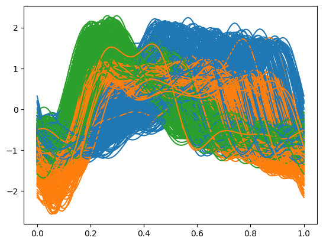

Advanced Usage
=================

In this advanced tutorial, we delve deeply into the analysis capabilities of the GPmix clustering framework. We use the `CBF dataset <https://www.timeseriesclassification.com/description.php?Dataset=CBF>`_, a well-known real-world time series dataset, which has been extensively studied in the literature and also analyzed in the paper: `Learning Mixtures of Gaussian Processes through Random Projection <https://proceedings.mlr.press/v235/akeweje24a.html>`_. This example will guide you through the essential steps of data smoothing, cluster number estimation, projection onto basis functions, and ensemble clustering of the GPmix algorithm.

To begin, we load the CBF dataset using the `aeon` library. This dataset contains multivariate time series data labeled into different classes. The loaded data is then squeezed to remove any unnecessary dimensions, preparing it for functional data analysis.

.. code-block:: python

   from aeon.datasets import load_classification
    X, y = load_classification("CBF")
    X = X.squeeze()

To harness the full power of GPmix, we import all core functionalities from the package along with the utility function for estimating the number of clusters. This setup ensures access to all necessary classes and methods for the subsequent analysis.

.. code-block:: python

   from GPmix import *
   from GPmix.misc import estimate_nclusters

Smoothing
---------

The first critical step in functional data analysis is to transform the raw discrete observations into smooth functional representations. This process reduces noise and captures the underlying continuous signal structure, which is essential for reliable clustering.

We initialize a ``Smoother`` object, specifying the type of basis functions used for smoothing. The choice of basis affects the flexibility and interpretability of the smoothed functions. Here, we select the Fourier basis, which is well-suited for periodic or oscillatory data like the CBF time series.

The ``basis_params`` argument allows customization of the smoothing process, such as the number of basis functions or regularization parameters. If left unspecified, GPmix automatically optimizes these parameters using techniques like Random Grid Search combined with Generalized Cross Validation (GCV), ensuring an optimal balance between smoothness and fidelity to the data.

After initializing the smoother, we apply the ``fit`` method to the raw data, which returns a functional data object representing the smoothed curves. Visualizing these smoothed functions grouped by their true labels can provide intuitive insight into the data's structure and variability within clusters.

.. code-block:: python

   sm = Smoother(basis='fourier')
   fd = sm.fit(X)
   fd.plot(group=y)

Estimating the number of clusters
---------------------------------

Determining the appropriate number of clusters is a fundamental challenge in unsupervised learning. GPmix provides the ``estimate_nclusters`` function to assist in this model selection task by evaluating clustering quality across a range of candidate cluster counts.

This function systematically fits models with varying numbers of clusters and calculates information criteria such as the Akaike Information Criterion (AIC) and Bayesian Information Criterion (BIC), which balance model fit and complexity. The optimal number of clusters corresponds to the minimum of these criteria, reflecting the best trade-off between data representation and parsimony.

By applying ``estimate_nclusters`` to the smoothed functional data, users gain an informed starting point for subsequent clustering steps, helping to avoid overfitting or underfitting.

.. code-block:: python

   estimate_nclusters(fd)
   # Output: 3

Projection
----------

Once the functional data is smoothed and the number of clusters estimated, the next step is to project the functional observations onto a set of basis functions. This projection extracts meaningful features (coefficients) that succinctly represent the data in a lower-dimensional space, facilitating efficient clustering.

The ``Projector`` object handles this transformation. It requires specifying the type of projection basis via ``basis_type`` and the number of projection functions ``n_proj`` to use. Additional customization is possible through ``basis_params``, enabling control over the basis family and parameters.

In this example, we choose wavelets as the projection basis, specifically the Haar wavelet family, which is effective for capturing localized features and abrupt changes in time series data. We set ``n_proj=25`` to extract 25 projection coefficients per observation, balancing detail and dimensionality.

After fitting the projector to the functional data, the resulting coefficients :math:`\alpha_{iv}` serve as the feature vectors for clustering.

The projection basis functions themselves can be visualized using the ``plot_basis`` method, offering insight into the nature of the features extracted.

.. code-block:: python

   proj = Projector(basis_type='wavelet', n_proj=25, basis_params={'wv_name': 'haar'})
   coeffs = proj.fit(fd)

.. code-block:: python

    proj.plot_basis()

To further understand the projection, you can visualize the computed coefficients for individual projections using ``plot_projection_coeffs()``. This reveals how each observation is represented in the projection space, highlighting variability across clusters.

.. code-block:: python

    proj.plot_projection_coeffs(5)

Ensemble Clustering: Learning GMMs and ensemble
-----------------------------------------------

Directly identifying a projection which best captures the underlying structure of functional data can be challenging. GPmix addresses this by employing an ensemble clustering approach based on univariate Gaussian Mixture Models (GMMs) fitted to each set of projection coefficients.

The ``UniGaussianMixtureEnsemble`` class orchestrates this process. By specifying the desired number of clusters (``n_clusters``), it fits a separate univariate GMM to each projection coefficient vector. This yields multiple base clusterings, each capturing different aspects of the data.

The ``fit_gmms`` method performs this fitting step, and the ``plot_gmms`` method allows visualization of the fitted GMM densities, providing diagnostic insight into the quality and separation of clusters per projection.

.. code-block:: python

   model = UniGaussianMixtureEnsemble(n_clusters=3)
   model.fit_gmms(coeffs)
   model.plot_gmms(ncols=5, fig_kws= dict(figsize=(15,15)))  # Visualize GMM fits

To obtain a consensus clustering that integrates information across all projections, the ``get_clustering`` method aggregates the base clusterings into an ensemble solution. This method leverages the strengths of individual projections while mitigating their weaknesses, resulting in a robust final clustering.

The predicted cluster labels are accessible via the ``labels_`` attribute. Visualization of the final clustering on the functional data can be performed using ``plot_clustering``, which aids in interpreting cluster assignments in the original data space.

.. code-block:: python

   pred_labels = model.get_clustering(fd)
   model.plot_clustering(fd)

The ensemble weights assigned to each base clustering reflect their relative importance in the final consensus. These weights, stored in ``cluster_weights_``, provide insight into which projections contribute most to the clustering solution. Plotting these weights can highlight dominant features or projections.

.. code-block:: python

    import matplotlib.pyplot as plt
    plt.plot(range(1,26), model.clustering_weights_, '-*')
    plt.ylabel('Ensembling weight')
    plt.xlabel('Clustering ID')
    plt.grid()

GPmix also supports rigorous evaluation of clustering quality through various internal and external validation indices. External validation metrics like Adjusted Mutual Information (AMI), Adjusted Rand Index (ARI), and Correct Classification Accuracy compare the clustering against known ground truth labels, providing quantitative measures of clustering accuracy.

Internal validation metrics such as the Silhouette Score and Davies-Bouldin Score assess the cohesion and separation of clusters based solely on the data and clustering results, useful when ground truth is unavailable.

For example, computing the AMI for the obtained clustering quantifies the agreement with true labels, with higher values indicating better clustering performance.

.. code-block:: python

   model.adjusted_mutual_info_score(y)   # 0.78929

The ``get_clustering`` method also supports the use of precomputed GMMs, allowing users to supply a custom subset of fitted models for ensemble construction. This flexibility enables advanced workflows such as greedy search for projection selection to optimize clustering quality.

As a demonstration, we use the first 14 GMMs from the previously fitted models to build an ensemble clustering. This selective approach can sometimes yield better clustering results by focusing on the most informative projections.

.. code-block:: python

    precomputed_gmms = model.gmms
    model.get_clustering(fd, precomputed_gmms = precomputed_gmms[:14])
    model.plot_clustering(fd)

According to the Adjusted Mutual Information metric, the ensemble clustering based on these 14 carefully selected projections slightly outperforms the one based on all 25 projections, illustrating the benefit of projection selection in ensemble clustering.