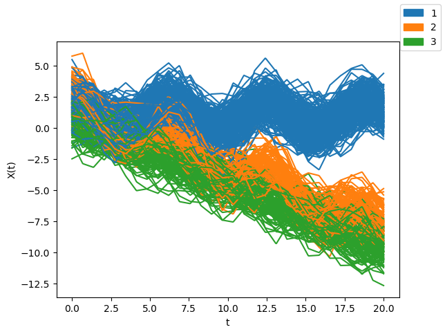
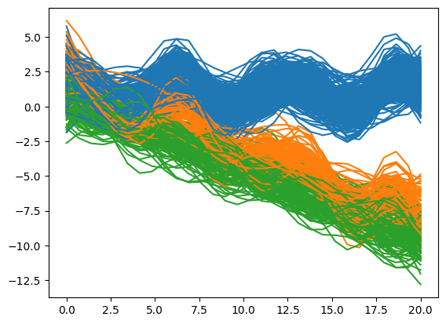

Quick Start
===========

This guide shows how to use the package with simulated data. We'll generate synthetic functional data from a mixture of Gaussian processes and prepare it for analysis:

.. code-block:: python

   import numpy as np
   import matplotlib.pyplot as plt
   import scipy
   import skfda

   def exponentiated_quadratic(xa, xb):
      sq_norm = -0.5 * scipy.spatial.distance.cdist(xa, xb, 'sqeuclidean')
      return np.exp(sq_norm)

   def get_data():
      nb_of_samples = 30
      t = np.expand_dims(np.linspace(0, 20, nb_of_samples), 1)
      Σ = exponentiated_quadratic(t, t)

      mean_curve = np.zeros((3, len(t)))
      mean_curve[0] = np.reshape(np.cos(t), (nb_of_samples))
      mean_curve[1] = np.reshape(np.cos(t) -0.5*t, (nb_of_samples))
      mean_curve[2] = np.reshape(-0.5*t + 0.5, (nb_of_samples))

      mixture_k = [1/2, 1/4, 1/4]
      n = 500
      Y = np.zeros((n, len(t)))
      simulation_label = np.zeros(n)

      for i in range(n):
         r = np.random.rand()
         if r <= mixture_k[0]:
               ys = 1 + np.random.multivariate_normal(mean= mean_curve[0], cov=Σ, size=1) + np.random.normal(0, 0.2, len(t))
               Y[i] = ys
               simulation_label[i] = 1
         elif r <= mixture_k[0] + mixture_k[1]:
               ys = 2 + np.random.multivariate_normal(mean= mean_curve[1], cov=Σ, size=1) + np.random.normal(0, 0.2, len(t))
               Y[i] = ys
               simulation_label[i] = 2
         else:
               ys = np.random.multivariate_normal(mean= mean_curve[2], cov=Σ, size=1) + np.random.normal(0, 0.2, len(t))
               Y[i] = ys
               simulation_label[i] = 3

      return skfda.FDataGrid(Y, grid_points=t.squeeze()), simulation_label

   X,y  = get_data()
   X.plot(group = y.astype(int), legend = True)
   plt.xlabel('t')
   plt.ylabel('X(t)')
   plt.show()

To use GPmix, import the main package and the cluster estimation utility:

.. code-block:: python

   from GPmix import *
   from GPmix.misc import estimate_nclusters

Smoothing
---------

Create a ``Smoother`` object to smooth the raw data. You can specify the basis type and parameters or let the system choose automatically. Then apply ``fit`` to get the smoothed data.

Here, we use B-spline basis:

.. code-block:: python

   sm = Smoother(basis='bspline')
   fd = sm.fit(X)
   fd.plot(group=y)

Estimating the number of clusters
---------------------------------

Use ``estimate_nclusters`` to find the optimal number of clusters by minimizing AIC or BIC:

.. code-block:: python

   estimate_nclusters(fd)
   # Output: 3

Projection
----------

Project the smoothed data onto chosen projection functions with ``Projector``. Specify the projection type and number of projections. Here, we use 8 random linear combinations of leading eigenfunctions ('rl-fpc'):

.. code-block:: python

   proj = Projector(basis_type='rl-fpc', n_proj=8)
   coeffs = proj.fit(fd)

Ensemble Clustering: Learning GMMs and ensemble
-----------------------------------------------

Use ``UniGaussianMixtureEnsemble`` to cluster the data by fitting univariate GMMs to each set of projection coefficients:

- Initialize with the number of clusters.
- Fit GMMs using ``fit_gmms``.
- Obtain consensus clustering with ``get_clustering``.

We set 3 clusters as estimated earlier:

.. code-block:: python

   model = UniGaussianMixtureEnsemble(n_clusters=3)
   model.fit_gmms(coeffs)
   pred_labels = model.get_clustering()

Visualize the clustering with:

.. code-block:: python

   model.plot_clustering(fd)

The model also offers clustering validation metrics. For external validation, compare predicted clusters to true labels using Adjusted Mutual Information, Adjusted Rand Index, and Correct Classification Accuracy. For internal validation, use Silhouette Score and Davies-Bouldin Score on the functional data.

Calculate all metrics as follows:

.. code-block:: python

   model.adjusted_mutual_info_score(y)   # Adjusted Mutual Information
   model.adjusted_rand_score(y)          # Adjusted Rand Index
   model.correct_classification_accuracy(y)  # Correct Classification Accuracy
   model.silhouette_score(fd)            # Silhouette Score
   model.davies_bouldin_score(fd)        # Davies-Bouldin Score